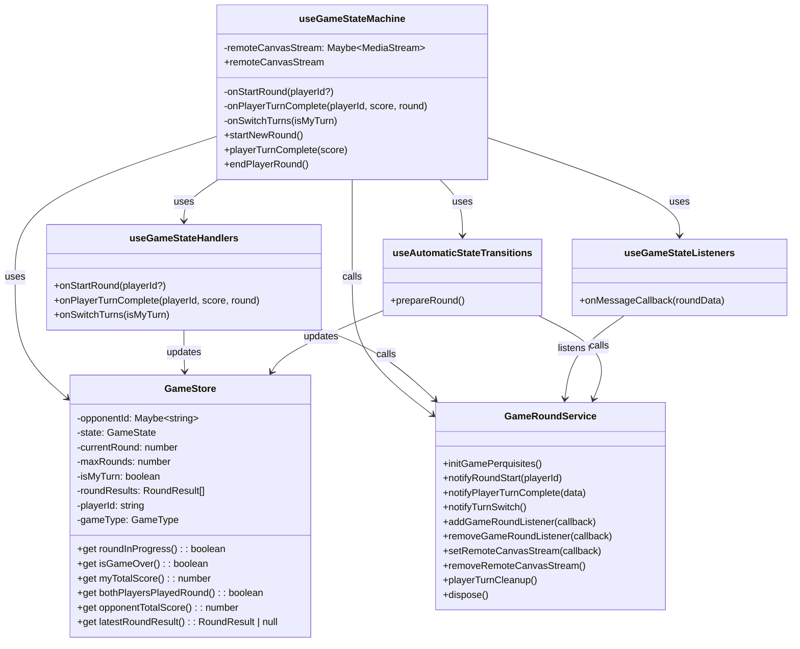
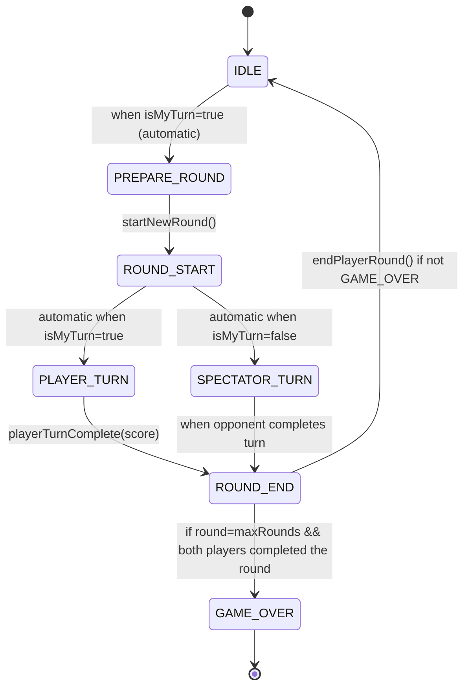
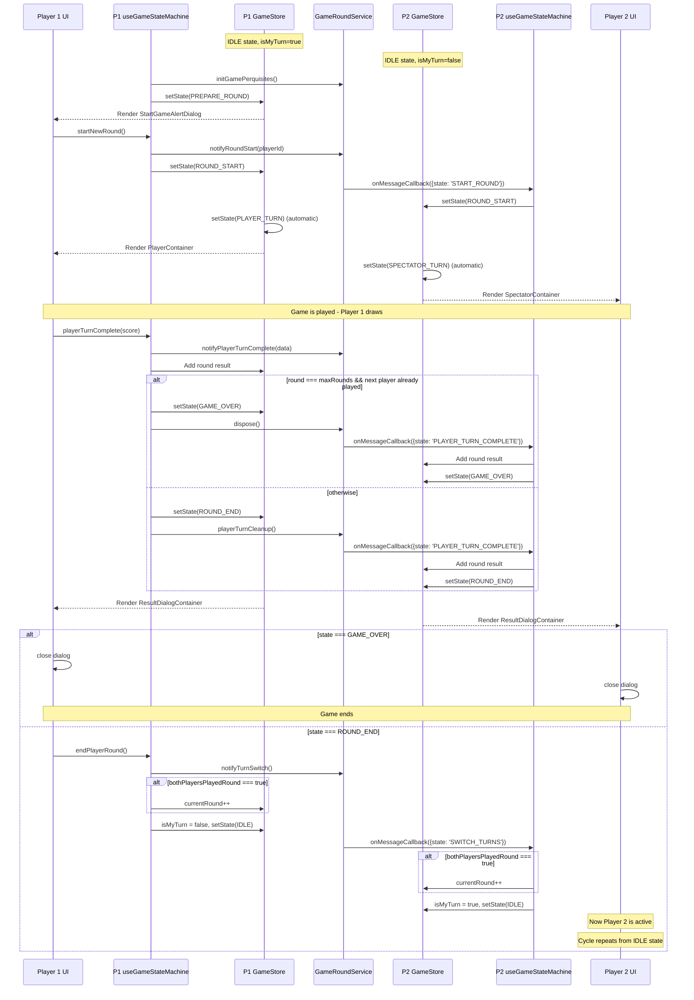

# Components Overview

**GameStore**: MobX store that maintains the game state, score tracking, and round progression. Defines states such as IDLE, PREPARE_ROUND, ROUND_START, PLAYER_TURN, SPECTATOR_TURN, ROUND_END, and GAME_OVER.

**GameRoundService**: Service that handles communication between players, manages audio/canvas streams, and coordinates game events. Provides methods for initiating rounds, notifying players of state changes, and cleaning up resources.

**useGameStateMachine**: React hook that connects the UI to the game state system, handles event listeners, state transitions, and provides a simplified API for components to interact with the game system.

**Supporting Hooks:**

- useGameStateHandlers: Provides callbacks for handling game state transitions
- useGameStateListeners: Sets up event listeners for game round events
- useAutomaticStateTransitions: Handles automatic state transitions based on current state

## State Flow

Game starts in IDLE state:

- When it's a player's turn and they're in IDLE, the system transitions to PREPARE_ROUND
- From PREPARE_ROUND (after user confirms), transitions to ROUND_START
- Then automatically transitions to either:
  - PLAYER_TURN (if it's the player's turn)
  - SPECTATOR_TURN (if it's the opponent's turn)

When a player's turn completes:

- Transitions to ROUND_END if there are more rounds to play
- Or transitions to GAME_OVER if all rounds are complete
- After the round/game ends, player 1 can initiate the next round or end the game

The state machine handles:

- Sending/receiving game events between players
- Managing player turns and round progression
- Tracking scores for both players
- Controlling the canvas streaming between players

# UML Diagrams

## Game State Machine UML Diagram

## State Transition Diagram

## Sequence Diagram for Game Round

## Implementation Details

1. GameStoreProvider - Creates and provides the GameStore instance to the component tree

2. GameContainer - The main container component that orchestrates the game UI based on the current state

3. Game Flow:
   - Game starts in IDLE with one player having isMyTurn=true
   - That player's game transitions to PREPARE_ROUND automatically
   - After confirmation, it transitions to ROUND_START → PLAYER_TURN
   - For the other player: ROUND_START → SPECTATOR_TURN
   - After completing a turn, transitions to ROUND_END
   - Then back to IDLE with turns switched
   - Repeats until all rounds complete, then GAME_OVER
4. Canvas Sharing:
   - During PLAYER_TURN, the active player's canvas is streamed to the other player
   - During SPECTATOR_TURN, the player sees the opponent's canvas stream
