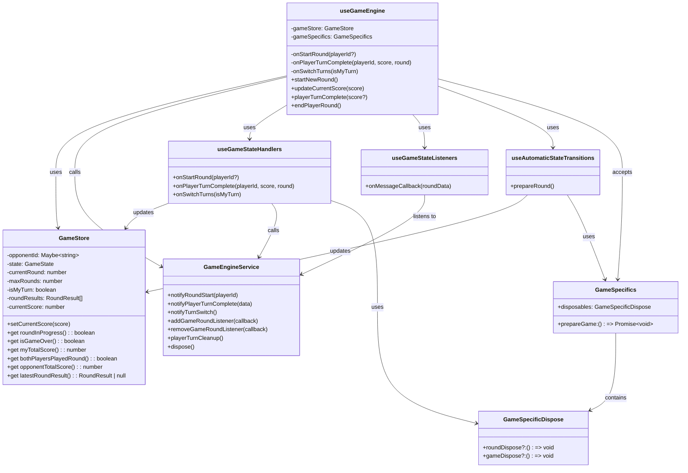
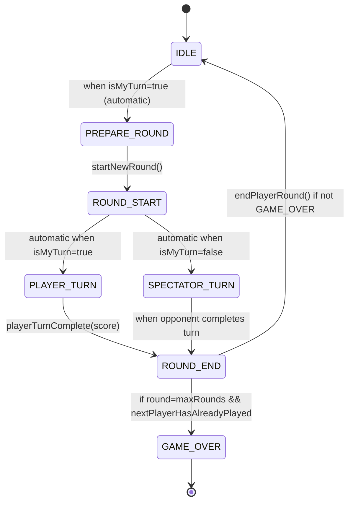
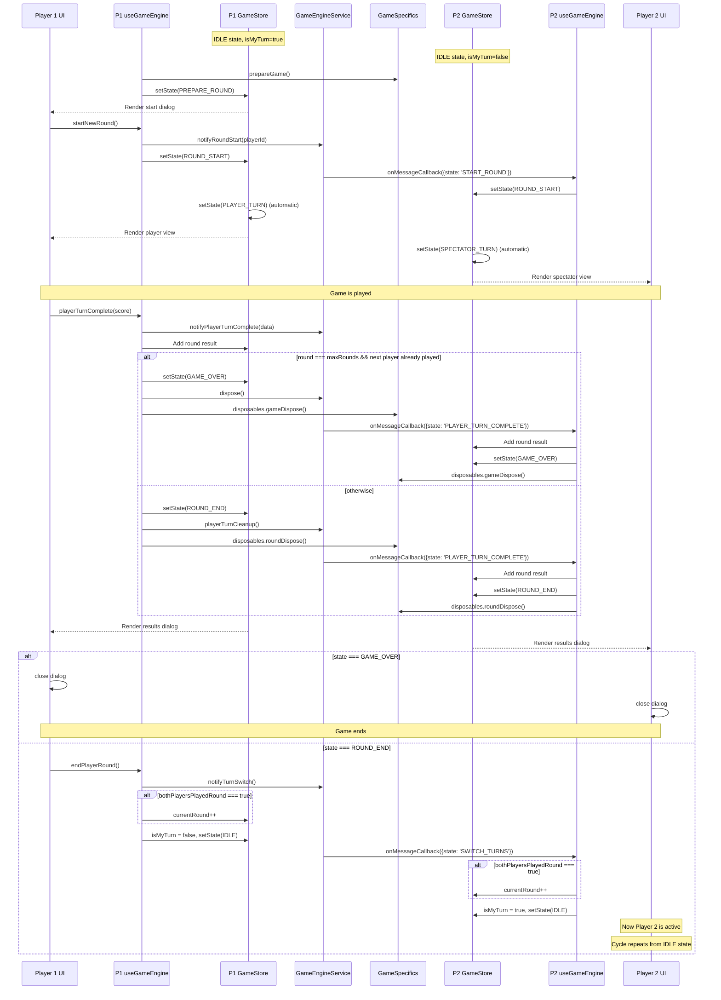

# Components Overview

**GameStore**: MobX store that maintains the game state, score tracking, and round progression. Defines states such as IDLE, PREPARE_ROUND, ROUND_START, PLAYER_TURN, SPECTATOR_TURN, ROUND_END, and GAME_OVER.

**GameEngineService**: Generic service that handles communication between players, coordinates game events, and provides methods for initiating rounds, notifying players of state changes, and cleaning up resources.

**useGameEngine**: Core React hook that connects the UI to the game state system, handles event listeners, state transitions, and provides a simplified API for components to interact with the game system.

**Supporting Hooks:**

- **useGameStateHandlers**: Provides callbacks for handling game state transitions
- **useGameStateListeners**: Sets up event listeners for game round events
- **useAutomaticStateTransitions**: Handles automatic state transitions based on current state

## State Flow

Game starts in IDLE state:

- When it's a player's turn and they're in IDLE, the system transitions to PREPARE_ROUND
- From PREPARE_ROUND (after user confirms), transitions to ROUND_START
- Then automatically transitions to either:
  - PLAYER_TURN (if it's the player's turn)
  - SPECTATOR_TURN (if it's the opponent's turn)

When a player's turn completes:

- Transitions to ROUND_END if there are more rounds to play
- Or transitions to GAME_OVER if all rounds are complete (when round === maxRounds AND next player has already played)
- After the round/game ends, player 1 can initiate the next round or end the game

The state engine handles:

- Sending/receiving game events between players
- Managing player turns and round progression
- Tracking scores for both players
- Integrating with game-specific functionality via dependency injection

# UML Diagrams

## Game State Engine UML Diagram

## State Transition Diagram

## Sequence Diagram for Game Round

## Implementation Details

1. **Game Engine Architecture**:

   - **GameStore**: Generic state store used by all games
   - **GameEngineContainer**: Wraps games inside a GameStore provider
   - **useGameEngine**: Core hook that manages state transitions and communication
   - **GameEngineService**: Handles inter-player communication
   - **Game-specific services**: Implement game-specific functionality

2. **Dependency Injection Pattern**:

   - Each game provides its own implementation for:
     - prepareGame: Initializes game-specific resources
     - disposables.roundDispose: Cleans up after each round
     - disposables.gameDispose: Cleans up when the game ends

3. **Game Flow**:

   - Game starts in IDLE with one player having isMyTurn=true
   - That player's game transitions to PREPARE_ROUND automatically
   - After confirmation, it transitions to ROUND_START → PLAYER_TURN
   - For the other player: ROUND_START → SPECTATOR_TURN
   - After completing a turn, transitions to ROUND_END
   - Then back to IDLE with turns switched
   - Repeats until all rounds complete, then GAME_OVER

4. **Implementing a New Game**:
   - Create a game-specific service (like PutinsPuppetService)
   - Create a game-specific hook (like usePutinsPuppet) that configures useGameEngine
   - Implement game-specific UI components
   - The core game engine handles state management and communication

This architecture _should_ allow for multiple game types to share the same state management and communication infrastructure while implementing their own game-specific logic.
